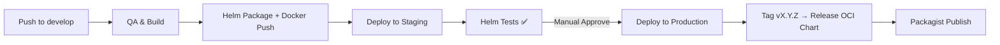

# 🧭 Order — CI/CD Dashboard

## 📦 Environments Overview
| Environment | Namespace | Status | Helm Chart Version | Notes |
|--------------|------------|--------|--------------------|-------|
| **Staging** | `order-staging` | ✅ Healthy / Auto-deploy | `${ORDER_CHART_VERSION:-latest}` | Auto deploys from `develop` |
| **Production** | `order-prod` | 🌀 Awaiting Approval / ✅ Stable | `${ORDER_CHART_VERSION:-latest}` | Manual approve after staging |
| **Release** | GHCR OCI Registry | 📦 Published | `oci://ghcr.io/taa0662621456/helm-charts/ordercomponent` | Tag-triggered (`v*`) |

---

## 🧩 Pipeline Flow


---

## 🧪 Status Legend
| Symbol | Meaning |
|:-------|:--------|
| ✅ | Passed (staging/prod tests ok) |
| 🚧 | In progress (deploying or waiting approval) |
| ❌ | Failed (check workflow logs) |
| 🌀 | Pending approval (manual gate for production) |
| 📦 | Published (release to GHCR & Packagist) |

---

## 🧭 Quick Commands
```bash
helmfile -f deploy/order/helmfile.yaml list -e staging
helm rollback order-prod <REV> -n order-prod
helm test order-staging -n order-staging
```

---

### 🧾 FAQ
**Q:** Как запустить публикацию на Packagist вручную?  
**A:** На странице Actions → выбери *Packagist Publish* → `Run workflow`.

**Q:** Где проверять опубликованную версию?  
**A:** [https://packagist.org/packages/smartresponsor/ordercomponent](https://packagist.org/packages/smartresponsor/ordercomponent)

**Q:** Как настроить auto-sync?  
**A:** В Packagist настрой webhook → URL: `https://github.com/<owner>/<repo>/` → auto update при push.
